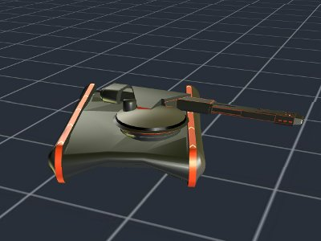

# Tron Tank Program

This is a model of a Tron Tank program from the 1982 Disney picture picture [Tron](https://en.wikipedia.org/wiki/Tron).

This model was originally downloaded in April 2011 from a COLLADA file shared by [Abraham Katase](https://3dwarehouse.sketchup.com/user.html?id=1058361951245355501624136&nav=models ) in the Google 3D Warehouse. 

Using the old SceneJS V0.8 COLLADA importer, it was then converted to [SceneJS JSON](/home/lindsay/xeolabs/dev/xeogl/examples/models/scenejs/tronTank/tronTank.json), and demonstrated as a Google Chrome Experiment. Click the screenshot below to run that experiment. 

In December 2017 the JSON model was imported into [xeogl](http:xeogl.org), using 
the [xeogl.SceneJSModel](http://xeogl.org/docs/classes/SceneJSModel.html) component.

## License Information

This model is free for use under the [3D Warehouse General Model License Agreement](https://3dwarehouse.sketchup.com/tos.html#license).
